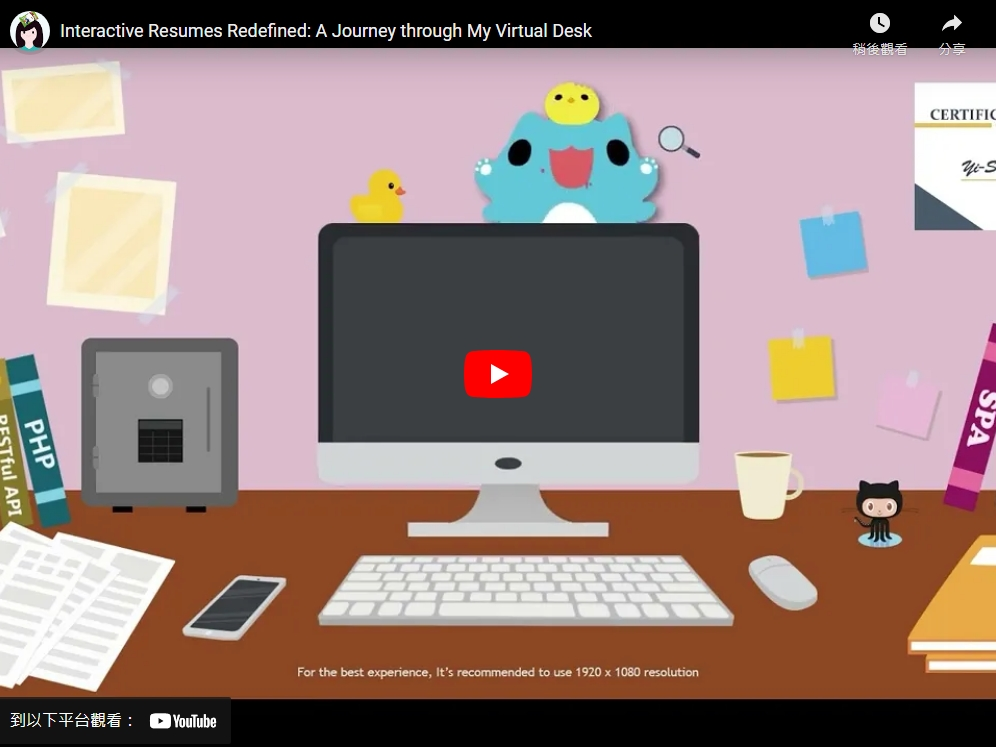

## 🧠 𝗔𝗕𝗢𝗨𝗧 𝗠𝗘

- An <b>enthusiastic</b> software engineer with four years of experience in web development.

- An <b>interviewer and mentor</b> for junior engineers. Helped an engineer get a job in the UK.

- Good at <b>collabirating</b> with people/org with different backgrounds including the Dominica government.

- Having several side projects including selling my own artwork online and writing articles about technical and working experiences.

 

## ✏ 𝗦𝗞𝗜𝗟𝗟𝗦

▪ <b>Programming Languages</b>: JavaScript, TypeScript, NodeJS, PHP, Python, SQL, CSS, SCSS, SASS

▪ <b>Framework</b>: React, Redux, React Hooks

▪ <b>Paradigms</b>: RESTful API, TDD, Agile, SPA

▪ <b>Dev Tools</b>: Docker, AWS, Babel, Jest, Enzyme, NPM, Git, Webpack, MySQL

 

## 🎨 𝗪𝗘𝗕𝗦𝗜𝗧𝗘𝗦

### Interactive Resume

### Wishing Pool

### More Portfolios

 
 
 

## 📚 𝗜𝗡𝗧𝗘𝗥𝗘𝗦𝗧𝗦

▪ <b>Drawing</b>
 - Sell the paintings on Etsy: [Trust Me I Am An Engineer](https://www.etsy.com/shop/TrustMeIAmAnEngineer)
 - Sell the stickers on [Line creators markets](https://store.line.me/stickershop/author/672687/en)

 

▪ <b>Writing technical and interviewing related articles blog: [工程師英國找工作紀錄 :: 抓住那個工程師](https://yschen25.blogspot.com/)</b>
 - Has an average 5,000 views/month
 - Articles were posted on famous international websites <b>Topal, Crossing.cw and 1111 job-hunting website, etc.</b>

<ul>
 
- 1111 人力銀行 - 科技島 : [國外找工作：收到 Meta (Facebook)、Amazon、Booking.com, Cisco, Yelp 等公司邀約的履歷 & 履歷網站, Resume, Web Resume, Github, LinkedIn 怎麼寫](https://www.technice.com.tw/experience/19370/)

- 換日線 : [技術審查通過、也聊得很開心，為什麼工程師面試海外職缺還是會敗在「最後這關」?](https://crossing.cw.com.tw/article/15187)

- 麥可故事貿易公司 : [非本科系畢業又常有轉職空窗期怎麼辦？我如何從在英國面試不斷被拒絕，到最後錄取上喜歡的工作](https://mikestorycompany.com/uk-interview-skills/)

- 麥可故事貿易公司 : [你想大大增加在國外面試錄取的機會嗎？那你一定要懂台灣公司不愛問，但是國外求職卻很注重的 Behavioural questions](https://mikestorycompany.com/behavioural-questions-interview/)

</ul>

 

▪ <b>Reading</b>

▪ <b>Workout</b>
